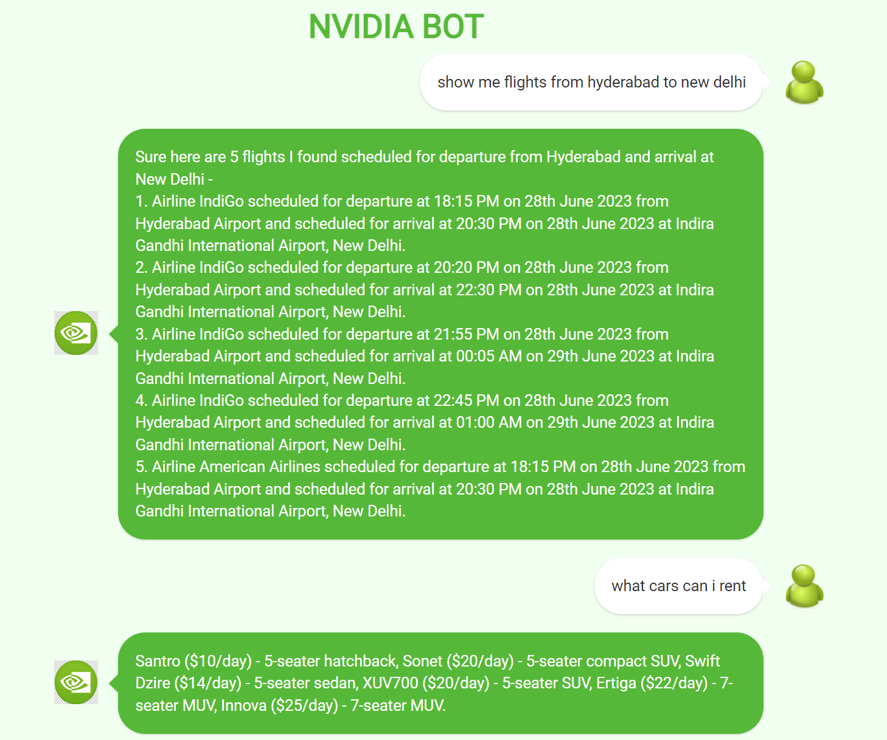
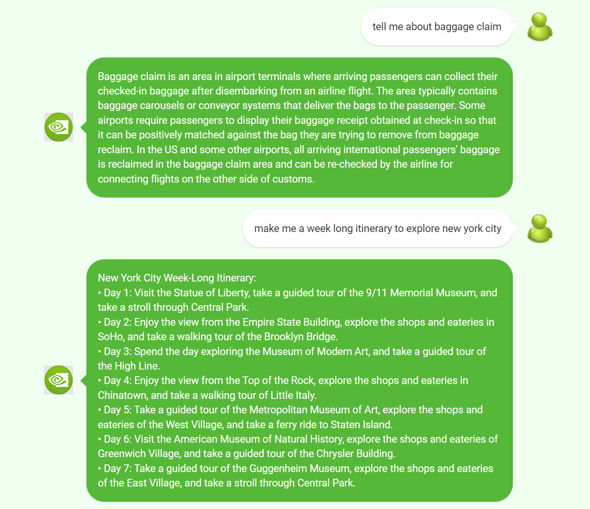
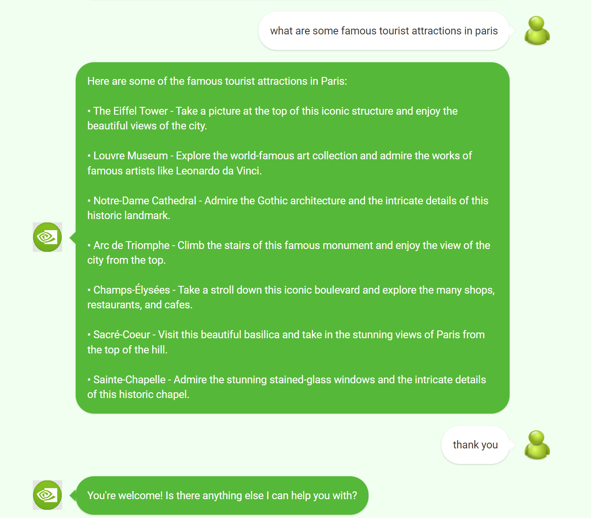

# TRAVEL BOT USING LANGCHAIN

## What is Travel Bot?

Travel bot is a conversational bot developed using Langchain library. This bot supports the following functionalities :

1. Get flights data between a departure city and an arrival city.
2. FAQ about baggage claim and car rental services (from KnowledgeBase documents).
3. Get travel plans and famous locations for a particular destination.
4. Book/rent a car (not yet functional)

## Sample conversations

Below are the screenshots of sample conversation between the bot and user showcasing the different type of queries supported by the bot.


<br><br><br>

<br><br><br>


## Run the bot

To run the bot, follow the below steps :

1. Add the API key for Aviationstack as an environment variable with the name `AVIATIONSTACK_API_KEY`. You can get the Aviationstack API key from [here](https://aviationstack.com/).

2. Also add the OpenAI API key as an environment variable with the name `OPENAI_API_KEY`.

3. Install the required libraries by running the command :

```
pip install -r bots/travel_bot_langchain/requirements.txt
```

4. run command :

```
python3 chat_agent.py
```
